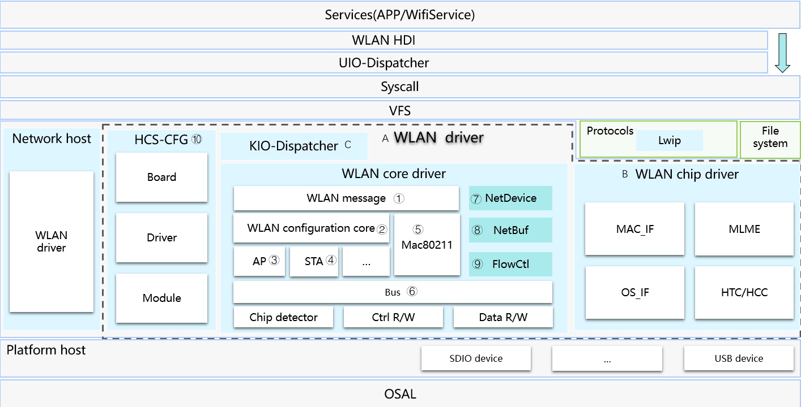
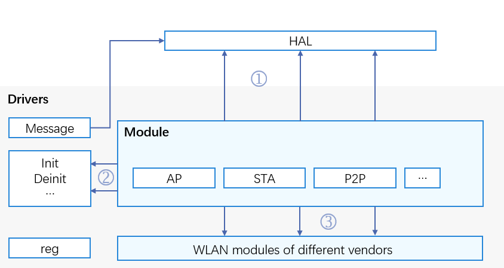

# WLAN Overview

## Introduction

The WLAN module is developed based on the OpenHarmony Driver Foundation. It supports cross-OS migration, component adaptation, and modular assembly and compilation. Based on the unified APIs provided by the WLAN module, driver developers of WLAN vendors can adapt their driver code and developers of the hardware abstraction layer \(HAL\) are capable of creating, disabling, scanning, and connecting to WLAN hotspots. The following figure shows the framework of the WLAN module:

**Figure  1**  WLAN framework  

## WLAN Driver API Architecture

The WLAN module provides the following three types of APIs:

-   APIs for HAL developers
-   APIs that can be called directly by driver developers
-   APIs for driver developers of different vendors to implement

This document provides guidelines on how to initialize a WLAN module.

**Figure  2**  Available APIs of the WLAN module  

## Available APIs

The WLAN driver module provides APIs for HAL developers, such as creating, disabling, scanning, connecting to or disconnecting from WLAN hotpots.

The WLAN driver module provides APIs that can be directly called by driver developers, such as creating/releasing a  **WifiModule**, connecting to/disconnecting from a WLAN hotspot, applying for/releasing a network data buffer, and converting between the  **pbuf**  structure of Lightweight TCP/IP Stack \(lwIP\) and a network data buffer.

Table 1 describes some APIs.

**Table  1**  APIs that can be directly called by driver developers

<table><thead align="left"><tr id="row121519334474"><th class="cellrowborder" valign="top" width="15.079999999999998%" id="mcps1.2.4.1.1">
File

</th>
<th class="cellrowborder" valign="top" width="60.33%" id="mcps1.2.4.1.2">
Function

</th>
<th class="cellrowborder" valign="top" width="24.59%" id="mcps1.2.4.1.3">
Description

</th>
</tr>
</thead>
<tbody><tr id="row112150333476"><td class="cellrowborder" rowspan="4" valign="top" width="15.079999999999998%" headers="mcps1.2.4.1.1 ">
wifi_module.h

</td>
<td class="cellrowborder" valign="top" width="60.33%" headers="mcps1.2.4.1.2 ">
struct WifiModule *WifiModuleCreate(const struct HdfConfigWifiModuleConfig *config);

</td>
<td class="cellrowborder" valign="top" width="24.59%" headers="mcps1.2.4.1.3 ">
Creates a <strong id="b17218103820131">WifiModule</strong>.

</td>
</tr>
<tr id="row112151233194714"><td class="cellrowborder" valign="top" headers="mcps1.2.4.1.1 ">
void WifiModuleDelete(struct WifiModule *module);

</td>
<td class="cellrowborder" valign="top" headers="mcps1.2.4.1.2 ">
Deletes and releases data of a <strong id="b17674114211319">WifiModule</strong>.

</td>
</tr>
<tr id="row1121533316475"><td class="cellrowborder" valign="top" headers="mcps1.2.4.1.1 ">
int32_t DelFeature(struct WifiModule *module, uint16_t featureType);

</td>
<td class="cellrowborder" valign="top" headers="mcps1.2.4.1.2 ">
Deletes a feature from a <strong id="b12747104710136">WifiModule</strong>.

</td>
</tr>
<tr id="row172153335473"><td class="cellrowborder" valign="top" headers="mcps1.2.4.1.1 ">
int32_t AddFeature(struct WifiModule *module, uint16_t featureType, struct WifiFeature *featureData);

</td>
<td class="cellrowborder" valign="top" headers="mcps1.2.4.1.2 ">
Adds a feature to a <strong id="b61351114111410">WifiModule</strong>.

</td>
</tr>
<tr id="row451796205011"><td class="cellrowborder" rowspan="4" valign="top" width="15.079999999999998%" headers="mcps1.2.4.1.1 ">
wifi_mac80211_ops.h

</td>
<td class="cellrowborder" valign="top" width="60.33%" headers="mcps1.2.4.1.2 ">
int32_t (*startAp)(NetDevice *netDev);

</td>
<td class="cellrowborder" valign="top" width="24.59%" headers="mcps1.2.4.1.3 ">
Starts an AP.

</td>
</tr>
<tr id="row5518663503"><td class="cellrowborder" valign="top" headers="mcps1.2.4.1.1 ">
int32_t (*stopAp)(NetDevice *netDev);

</td>
<td class="cellrowborder" valign="top" headers="mcps1.2.4.1.2 ">
Stops an AP.

</td>
</tr>
<tr id="row851915617503"><td class="cellrowborder" valign="top" headers="mcps1.2.4.1.1 ">
int32_t (*connect)(NetDevice *netDev, WifiConnectParams *param);

</td>
<td class="cellrowborder" valign="top" headers="mcps1.2.4.1.2 ">
Starts a connection.

</td>
</tr>
<tr id="row18519136185016"><td class="cellrowborder" valign="top" headers="mcps1.2.4.1.1 ">
int32_t (*disconnect)(NetDevice *netDev, uint16_t reasonCode);

</td>
<td class="cellrowborder" valign="top" headers="mcps1.2.4.1.2 ">
Cancels a connection.

</td>
</tr>
<tr id="row176421942125016"><td class="cellrowborder" rowspan="5" valign="top" width="15.079999999999998%" headers="mcps1.2.4.1.1 ">
hdf_netbuf.h

</td>
<td class="cellrowborder" valign="top" width="60.33%" headers="mcps1.2.4.1.2 ">
static inline void NetBufQueueInit(struct NetBufQueue *q);

</td>
<td class="cellrowborder" valign="top" width="24.59%" headers="mcps1.2.4.1.3 ">
Initializes a network data buffer queue.

</td>
</tr>
<tr id="row664264225020"><td class="cellrowborder" valign="top" headers="mcps1.2.4.1.1 ">
struct NetBuf *NetBufAlloc(uint32_t size);

</td>
<td class="cellrowborder" valign="top" headers="mcps1.2.4.1.2 ">
Applies for a network data buffer.

</td>
</tr>
<tr id="row19642134215018"><td class="cellrowborder" valign="top" headers="mcps1.2.4.1.1 ">
void NetBufFree(struct NetBuf *nb);

</td>
<td class="cellrowborder" valign="top" headers="mcps1.2.4.1.2 ">
Releases a network data buffer.

</td>
</tr>
<tr id="row7643194215013"><td class="cellrowborder" valign="top" headers="mcps1.2.4.1.1 ">
struct NetBuf *Pbuf2NetBuf(const struct NetDevice *netdev, struct pbuf *lwipBuf);

</td>
<td class="cellrowborder" valign="top" headers="mcps1.2.4.1.2 ">
Converts the <strong id="b108101241316">pbuf</strong> structure of <strong id="b148154412318">lwIP</strong> to a network data buffer.

</td>
</tr>
<tr id="row7657132317518"><td class="cellrowborder" valign="top" headers="mcps1.2.4.1.1 ">
struct pbuf *NetBuf2Pbuf(const struct NetBuf *nb);

</td>
<td class="cellrowborder" valign="top" headers="mcps1.2.4.1.2 ">
Converts a network data buffer to the <strong id="b993215663110">pbuf</strong> structure of <strong id="b10933563310">lwIP</strong>.

</td>
</tr>
</tbody>
</table>

The WLAN driver module provides APIs for driver developers to implement capabilities, such as initializing/deregistering, opening/stopping a network device, and obtaining the state of a network device.

Table 2 describes some APIs.

**Table  2**  APIs for driver developers of WLAN vendors to implement

<table><thead align="left"><tr id="row194625016476"><th class="cellrowborder" valign="top" width="20.75%" id="mcps1.2.4.1.1">
File

</th>
<th class="cellrowborder" valign="top" width="52.75%" id="mcps1.2.4.1.2">
Function

</th>
<th class="cellrowborder" valign="top" width="26.5%" id="mcps1.2.4.1.3">
Description

</th>
</tr>
</thead>
<tbody><tr id="row04616509472"><td class="cellrowborder" rowspan="6" valign="top" width="20.75%" headers="mcps1.2.4.1.1 ">
net_device.h

</td>
<td class="cellrowborder" valign="top" width="52.75%" headers="mcps1.2.4.1.2 ">
int32_t (*init)(struct NetDevice *netDev);

</td>
<td class="cellrowborder" valign="top" width="26.5%" headers="mcps1.2.4.1.3 ">
Initializes a network device.

</td>
</tr>
<tr id="row1546250114713"><td class="cellrowborder" valign="top" headers="mcps1.2.4.1.1 ">
struct NetDevStats *(*getStats)(struct NetDevice *netDev);

</td>
<td class="cellrowborder" valign="top" headers="mcps1.2.4.1.2 ">
Obtains the state of a network device.

</td>
</tr>
<tr id="row1646165010470"><td class="cellrowborder" valign="top" headers="mcps1.2.4.1.1 ">
int32_t (*setMacAddr)(struct NetDevice *netDev, void *addr);

</td>
<td class="cellrowborder" valign="top" headers="mcps1.2.4.1.2 ">
Sets the MAC address.

</td>
</tr>
<tr id="row12471250184711"><td class="cellrowborder" valign="top" headers="mcps1.2.4.1.1 ">
void (*deInit)(struct NetDevice *netDev);

</td>
<td class="cellrowborder" valign="top" headers="mcps1.2.4.1.2 ">
Deinitializes a network device.

</td>
</tr>
<tr id="row13471050104719"><td class="cellrowborder" valign="top" headers="mcps1.2.4.1.1 ">
int32_t (*open)(struct NetDevice *netDev);

</td>
<td class="cellrowborder" valign="top" headers="mcps1.2.4.1.2 ">
Opens a network device.

</td>
</tr>
<tr id="row1747125054714"><td class="cellrowborder" valign="top" headers="mcps1.2.4.1.1 ">
int32_t (*stop)(struct NetDevice *netDev);

</td>
<td class="cellrowborder" valign="top" headers="mcps1.2.4.1.2 ">
Stops a network device.

</td>
</tr>
</tbody>
</table>

