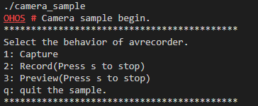
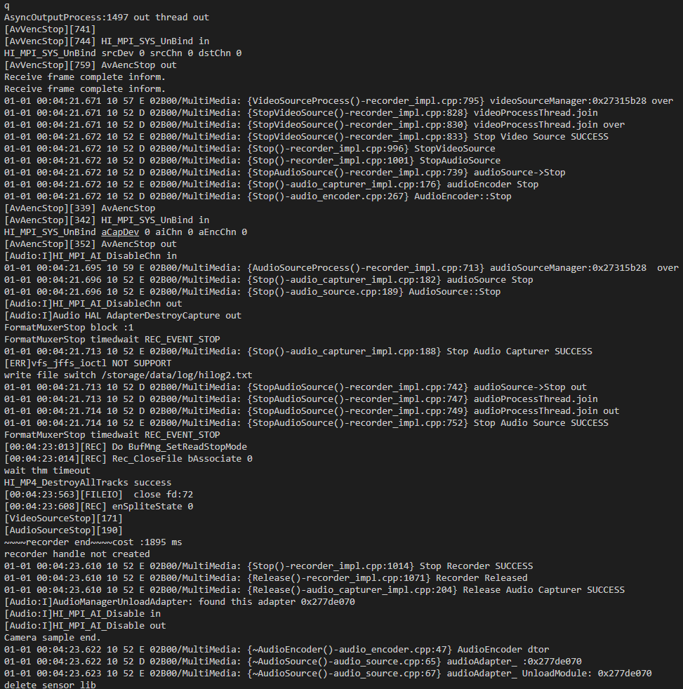

# Use Case

-   For details about the development board, compilation, burning, and image running process, see  [Getting Started with Hi3518](en-us_topic_0000001054261054.md). The compilation results include that of the  **camera\_sample**  program.
-   The sample code for camera development is stored in  **applications/sample/camera/media/camera\_sample.cpp**.

    > **NOTICE:** 
    >You should insert a TF card \(maximum capacity: 128 GB\) for photographing and video recording functions. After the system is started, the TF card is automatically mounted to the  **/sdcard**  directory. If the TF card is inserted after the system is started, you have to manually mount the TF card. To view the photos and videos in the TF card, copy the content to a computer. The preview function does not require a TF card.

1.  Start the  **camera\_sample**  program.

    **Figure  1**  Starting camera\_sample  
    

    The control commands are displayed as shown in the preceding figure. Press  **S**  to stop the current operation \(including video recording and preview\), and press  **Q**  to exit the program.

2.  Press  **1**  to take a photo in JPG format. The photo is saved in the  **/sdcard**  directory and named  **Capture\***.

    **Figure  2**  Serial port logs displayed after the photographing command is executed  
    

    To view the saved file, exit the program and enter the file system. To start the program again, return to  [Step 1](use-case-5.md#li15116103915513).

    **Figure  3**  Saved files  
    

3.  Press  **2**  to start recording. The video file is in MP4 format and saved in the  **/sdcard**  directory with the name  **Record\***. Press  **S**  to stop recording.

    **Figure  4**  Serial port logs displayed after the recording command is executed  
    

4.  Press  **Q**  to exit.

    **Figure  5**  Serial port logs displayed after the exit command is executed  
    

