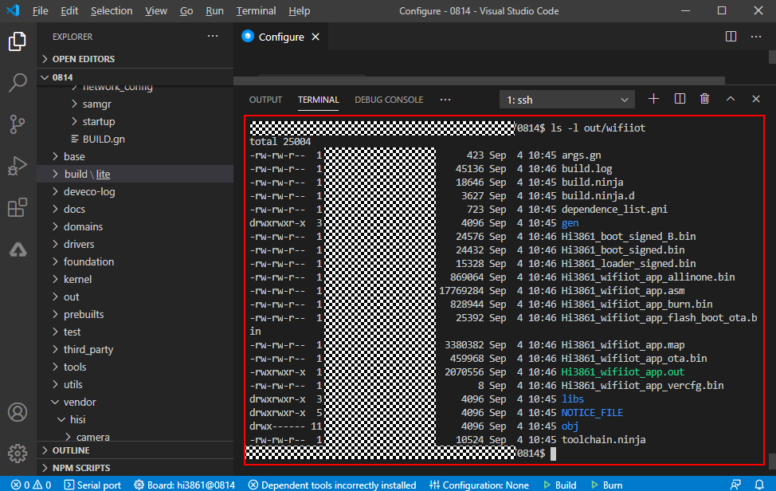
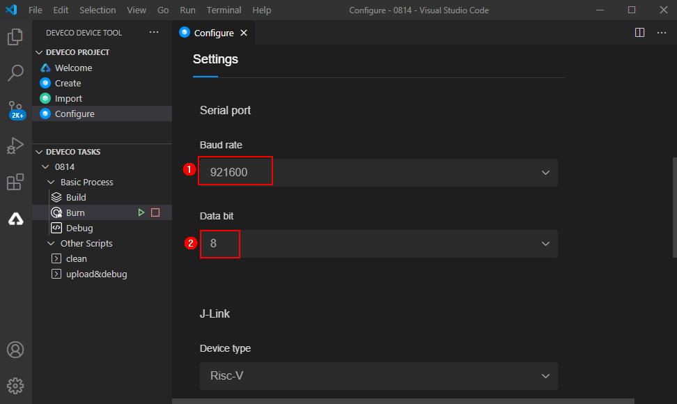
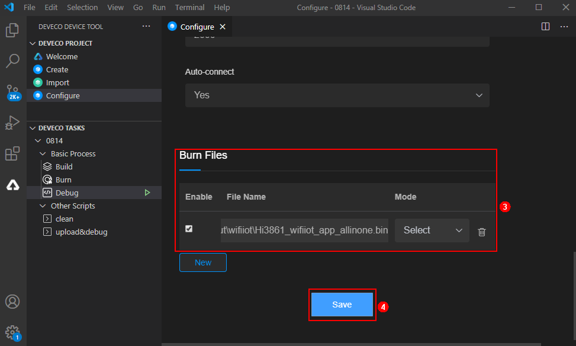
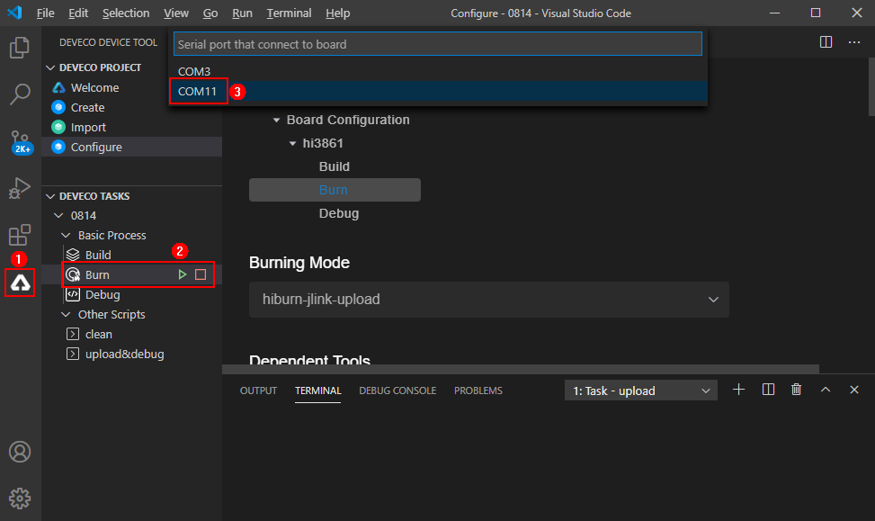
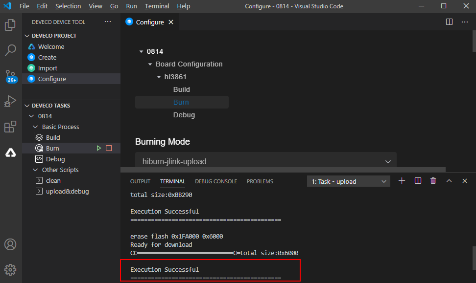
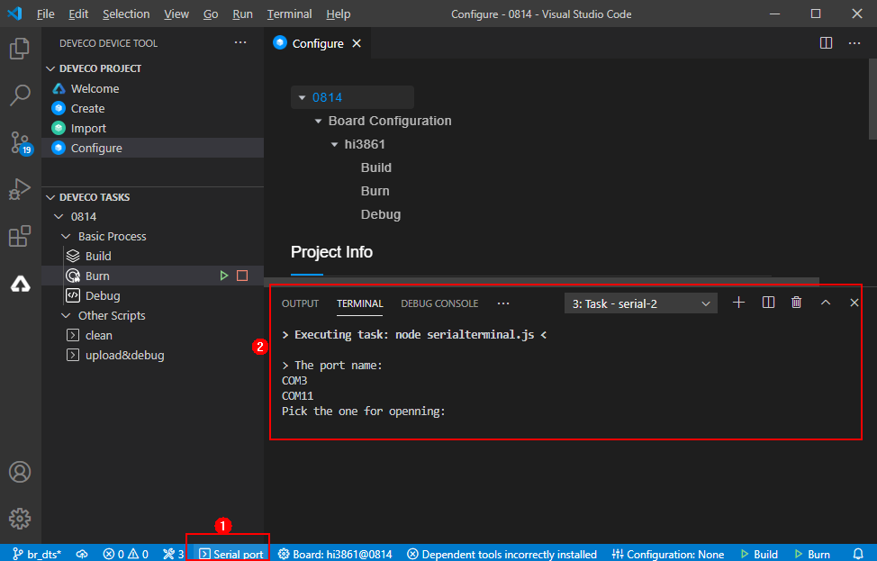
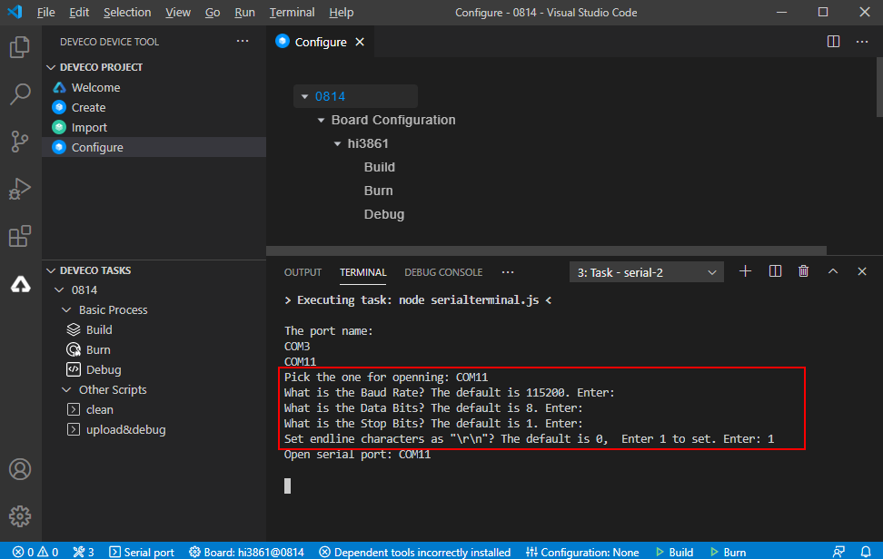
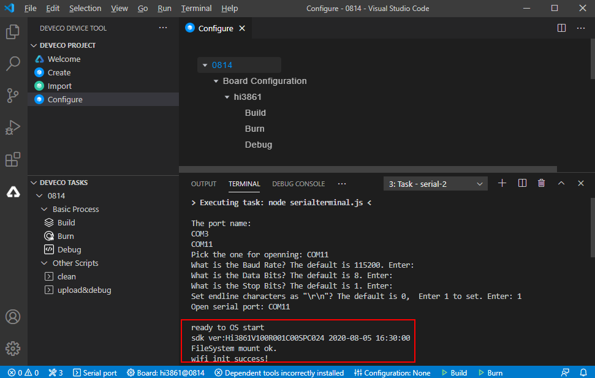
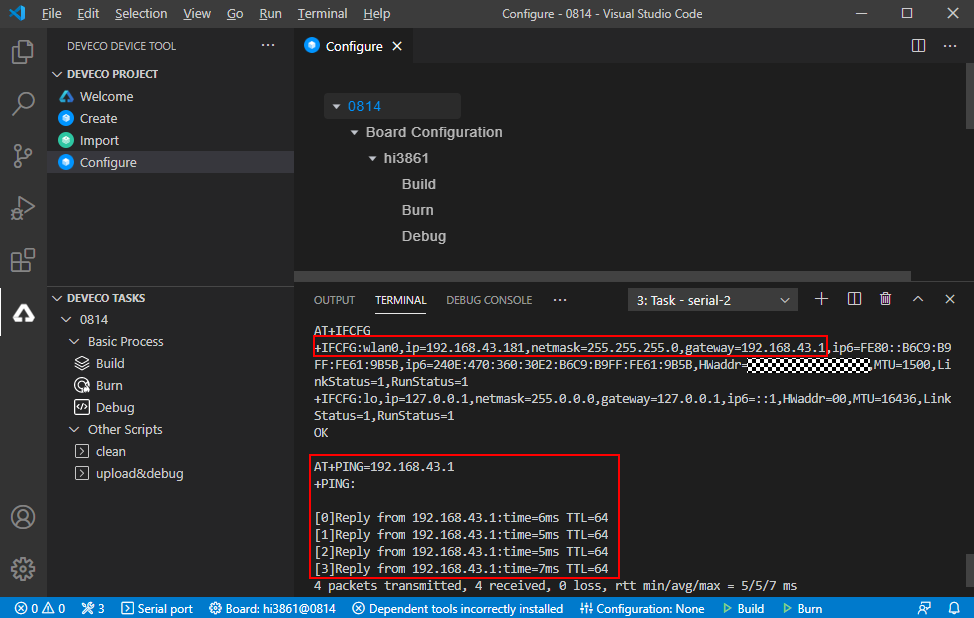

# Developing the First Example Program Running on Hi3861<a name="EN-US_TOPIC_0000001053302600"></a>

This example shows how to use attention \(AT\) commands to complete WLAN module networking.

## Acquiring Source Code<a name="section1545225464016"></a>

You need to acquire  [Hi3861 source code](http://tools.harmonyos.com/mirrors/os/1.0/code-1.0.tar.gz)  and download it on a Linux server. For more obtaining methods, see  [Source Code Acquisition](../get-code/source-code-acquisition.md).

## Compiling Source Code<a name="section1736014117148"></a>

This section describes how to compile the WLAN module on a Linux server.

1.  Use the OpenHarmony IDE DevEco to connect to a Linux server. \(The IDE DevEco integrates the capabilities of terminal tools. For details about how to use the tool, see  [User Guide](https://device.harmonyos.com/en/docs/ide/user-guides/service_introduction-0000001050166905).\)

    Click  **View**  and then  **Terminal**  to start the IDE terminal tool.

    **Figure  1**  Starting the IDE terminal tool<a name="fig1975813338510"></a>  
    

    

    On the TERMINAL page, run the ssh command, for example,  **ssh  _user_@_ipaddr_**, to connect to the Linux server.

    **Figure  2**  TERMINAL page<a name="fig91165301546"></a>  
    

    

2.  Go to the root directory of the code and run the  **python build.py wifiiot**  command in the TERMINAL page to start compilation.

    **Figure  3**  Running the compilation command on TERMINAL page<a name="fig17727115215612"></a>  
    

    

3.  Check whether the building is successful. If yes,  **BUILD SUCCESS**  will be displayed, as shown in the following figure.

    **Figure  4**  Successful building<a name="fig1262101218463"></a>  
    

4.  Check whether the following files are generated in the  **out/wifiiot**  directory.

    **Figure  5**  Directory for storing compilation files<a name="fig38521346164618"></a>  
    

    


## Burning Images<a name="section1610612214150"></a>

You can use the DevEco tool to perform the image burning of the Hi3861 WLAN module. For details about how to use the tool, see  [User Guide](https://device.harmonyos.com/en/docs/ide/user-guides/service_introduction-0000001050166905).

1.  Use a USB cable to connect to the Windows workstation and WLAN module. \(Before the connection to the WLAN module, download the USB-to-serial driver from  [http://www.wch.cn/search?q=ch340g&t=downloads](http://www.wch.cn/search?q=ch340g&t=downloads)  and install it.\) In addition, query the COM port on the device manager, for example, CH340 \(COM11\) which provides functions of code burning, log printing, and AT commands execution.

    **Figure  6**  COM port of the device manager<a name="fig85905394917"></a>  
    

2.  Enter the burning configuration page.

    **Figure  7**  Basic configurations for image burning<a name="fig16939203111472"></a>  
    

    

3.  Configure basic parameters.

    1.  Set a proper baud rate. A higher baud rate indicates a faster burning speed. Here  **921600**  is recommended.
    2.  Select a data bit. The default value of  **Data bit**  for the WLAN module is  **8**.
    3.  Select the version package path by running the  **./out/wifiiot/Hi3861\_wifiiot\_app\_allinone.bin**  command.
    4.  Click  **Save**  to save configurations.

    **Figure  8**  Baud rate and data bit configurations<a name="fig4315145184815"></a>  
    

    **Figure  9**  Path of the burning package<a name="fig105491550185115"></a>  
    

    

4.  On the DevEco, click  **Burn**   and select the serial port  **COM11**.

    **Figure  10**  Starting a burning<a name="fig051518341529"></a>  
    

5.  After the serial port is selected,  **Connecting, please reset device...**  is shown below the  **TERMINAL**  tab, indicating that the module is in the to-be-burnt state.

    **Figure  11**  Burning process<a name="fig233565715549"></a>  
    

6.  Press the  **Reset**  key on the module to start burning.  **Execution Successful**  displayed below the  **TERMINAL**  tab indicates the burning is complete.

    **Figure  12**  Burning completed<a name="fig191921618564"></a>  
    

    


## Connecting WLAN Module to Internet<a name="section168257461059"></a>

After completing version building and burning, do as follows to execute AT commands on DevEco to connect the WLAN module to internet.

1.  Keep Windows workstation connected to the WLAN module and click  **Serial port**  at the bottom of DevEco to view the configuration page.

    **Figure  13**  Opening the DevEco serial port<a name="fig749694135716"></a>  
    

2.  Select the serial port and set parameters. Enter the actual serial port number. Here the serial port number is  **COM11**; the default values of Baud rate, Data bit, and Stop bit are used;  **1**  is used as the end-line character since a valid input AT command must end with  **\\r\\n**.

    **Figure  14**  Configuring the serial port<a name="fig179371422175815"></a>  
    

3.  Reset the WLAN module. The message  **ready to OS start**  is displayed on the terminal page, indicating that the WLAN module is started successfully.

    **Figure  15**  Resetting the WLAN module<a name="fig227819127594"></a>  
    

4.  Run the following AT commands on the DevEco serial port in sequence to start the STA, connect to the specified AP, and enable the Dynamic Host Configuration Protocol \(DHCP\).

    ```
    AT+STARTSTA                             - Start the STA mode.
    AT+SCAN                                 - Scan for available APs.
    AT+SCANRESULT                           - Display the scanning result.
    AT+CONN="SSID",,2,"PASSWORD"            - Connect to the specified AP. (SSID and PASSWORD represent the name and password of the hotspot to be connected, respectively.)
    AT+STASTAT                              - View the connection result.
    AT+DHCP=wlan0,1                         - Request the IP address of wlan0 from the AP via DHCP.
    ```

5.  An IP address is assigned and the interface is properly connected to the gateway.

    **Figure  16**  Successful networking of the WLAN module<a name="fig834919451597"></a>  
    


