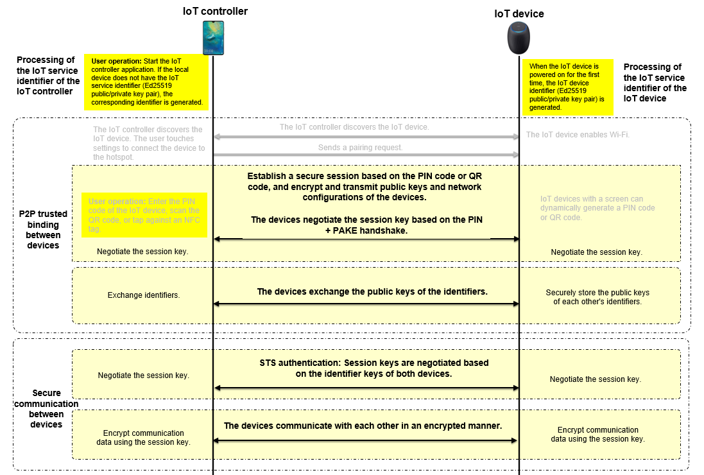

# Device Interconnection Security

## Mechanism

To transmit user data securely between devices, ensure that the devices are trusted by each other. A trust relationship and a secure data transmission channel must be established between the devices. The following figure shows how an IoT controller and an IoT device establish a trust relationship.

**Figure  1**  How an IoT controller and an IoT device establish a trust relationship  

-   **IoT device interconnection security**

    A trust relationship can be established between an IoT device that runs OpenHarmony \(such as an AI speaker, smart home device, and wearable\) and an IoT controller. Encrypted user data is transmitted between the IoT device and IoT controller through a secure connection.

-   **IoT service identifier of the IoT controller**

    An IoT controller generates different identifiers for different IoT device management services to isolate these services. The identifier can be used for authentication and communication between an IoT controller and an IoT device. It is an Ed25519 public/private key pair generated using the elliptic curve cryptography.

-   **IoT device identifier**

    An IoT device can generate its own device identifier for communicating with the IoT controller. It is also an Ed25519 public/private key pair generated using elliptic curve cryptography, with the private key stored on the IoT device. Each time the device is restored to factory settings, the public/private key pair will be reset.

    The identifier can be used for secure communication between the IoT controller and IoT device. After the devices exchange the service identifier or device identifier, they can negotiate the key and establish a secure communication channel.

-   **P2P trusted binding between devices**

    When an IoT controller and an IOT device establish a trust relationship, they exchange identifiers.

    During this process, the user needs to enter or scan the PIN provided by the IoT device on the IoT controller. PIN is either dynamically generated if the IoT device has a screen, or preset by the manufacturer if it does not have a screen. A PIN can be a number or a QR code. Then the IoT controller and IoT device perform authentication and session key exchange based on password authenticated key exchange \(PAKE\), and use the session key to encrypt the channel for exchanging identity public keys.

-   **Secure communication between the IoT controller and IoT device**

    When an IoT controller and an IoT device communicate with each other after establishing a trust relationship, they authenticate each other by using the locally stored identity public key of the peer. Bidirectional identity authentication and session key exchange are performed using the Station-to-Station \(STS\) protocol during each communication. The session key is used to encrypt the data transmission channel between the devices.

