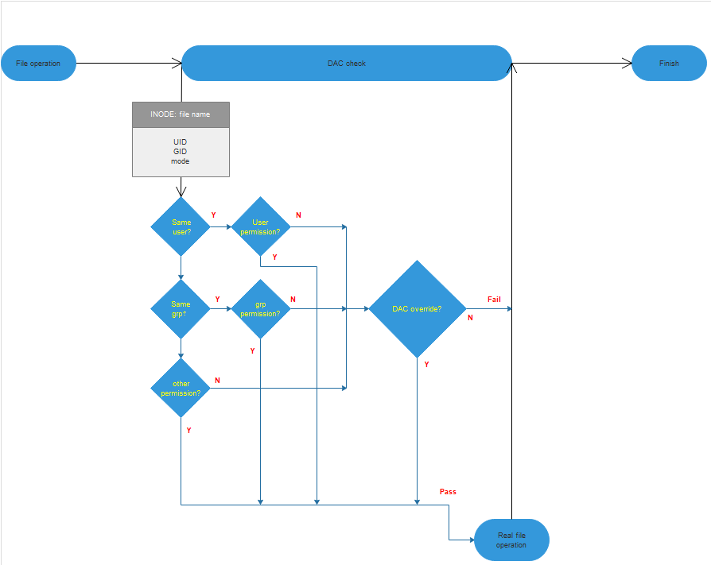

# System Security

## Mechanism

-   Process isolation

    Process isolation prevents processes from reading and writing memory data of each other. Generally, virtual address space mapping is used for process isolation. The virtual addresses of two processes are mapped to physical address segments using the memory management unit \(MMU\). In this way, the non-shared memory data that can be accessed by one of the two processes through the virtual address is inaccessible to the other process.

    Due to limited resources, OpenHarmony adopts different mechanisms for kernel-level and user-level processes. All kernel-level processes share the same VMM space, that is, kernel-level processes are not isolated from each other. When the OS is booted, two basic kernel-level processes KProcess and KIdle are created. KProcess is the root process of kernel-level process, and KIdle is the subprocess of KProcess. Each user-level process has its own VMM space that is invisible to other processes, and user-level processes are isolated from each other.

-   Discretionary access control

    Discretionary access control \(DAC\) means that the file owner determines access permissions of other roles from three dimensions: user, group, and other. The file owner can classify any user into one of the three dimensions and adopt a control policy to perform DAC permission verification. Each application has a UID. When creating a file, an application adds its UID to the metadata of the file and sets permissions of the user, group, and other. When an application tries to access the file, the UID and permissions in the metadata of the file are used to verify the application UID. DAC depends on the attributes of processes, such as the UID and GID, which are used as feature IDs during file creation and access. When creating a file, the creator writes its UID into the file. When a file is accessed, the UID is used for classifying the file.

    The following figure shows how DAC works when a process accesses a file. The DAC first matches the process UID with the file UID, and then the process GID with the file GID. If the UID and GID both fail to match, DAC checks the  **other**  attribute of the file to determine whether the process is allowed to read, write, or execute the file. In addition, the system supports a privileged capability that is not subject to DAC mechanism and can access files directly. Services with high permissions \(such as system services\) can manage files of applications with low permissions \(such as third-party applications\).

    **Figure  1**  How DAC works  
    

    

-   Capability mechanism

    The capability mechanism is a subdivision of the root permission. A multi-user computer system usually has a special role that has all system permissions, that is, the system administrator with the root permission. OpenHarmony needs to support kernels of the third-party application ecosystem, and privileged access to the system must be controlled. The system needs to restrict privileged system calls made by users to access the kernel. Only some applications with high-level permissions are allowed to perform privileged operations. To be specific, the kernel spawns the first user program INIT that has all privileged permissions. Then INIT starts other application framework services and retains only privileged permissions necessary for each application. When an application requests to call a privileged API, the kernel checks whether the application has the permission to access the API based on the process ID.

-   Secure boot

    Secure boot is the basis of system security. A digital signature and integrity verification mechanism is used to verify the integrity and validity of software at each layer, starting from the boot root of trust in the chip. This ensures that a correct and valid OS is booted, preventing attackers from tampering with or implanting system software and providing a secure, basic running environment.

    The chip does not need to be verified after it is powered on because the on-chip ROM code cannot be modified. The on-chip ROM verifies the bootloader based on the public key hash value which is calculated using the asymmetric algorithm in eFuse. The verification is performed based on the hardware trust root and is fully trusted. The bootloader that passes this verification is deemed to be trusted for subsequent use. This is the process of constructing a trust chain. Bootloader initializes the execution environment, including initializing the double data rate \(DDR\) and reading and writing the flash memory, to prepare for loading modules and executing more complex logic. After the bootloader is initialized, it verifies the integrity of the X.509 certificate and verifies image packages \(**kernel.bin**,  **teeOS.bin**, and  **rootfs.bin**\) using the public key of the X.509 certificate.

## Recommended Practices

-   DAC and the capability mechanism are used to control who can access resources. It is recommended that the minimum permissions are granted.
-   Secure boot must be enabled, and the trusted root must be in the chip and cannot be modified. In addition, you must consider the impact of secure upgrade \(if available\) on secure boot, that is, the signature or hash value of an image file must be updated after a secure upgrade.

