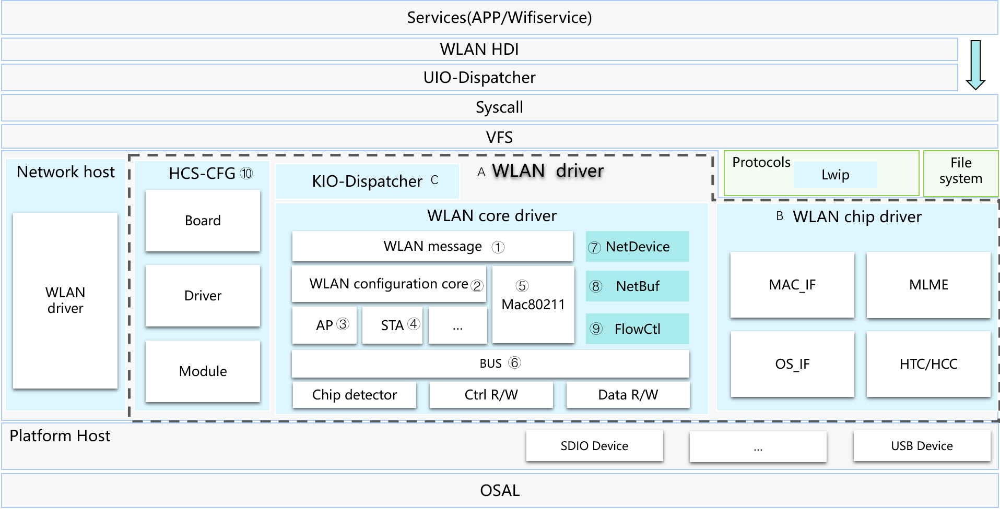
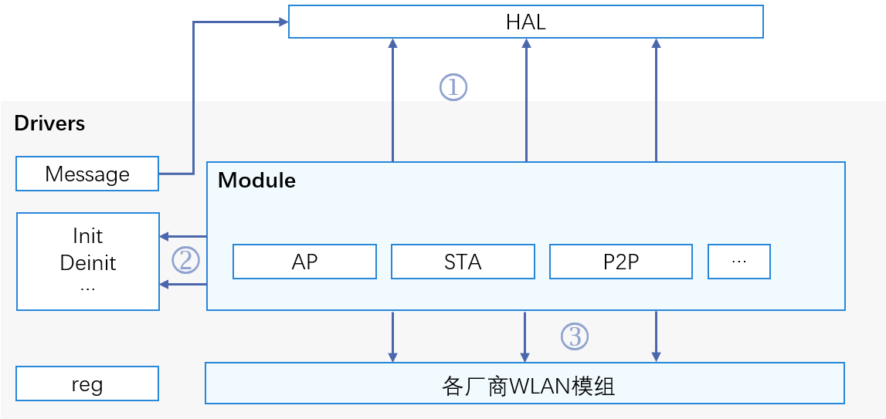

# WLAN开发概述

## 简介

WLAN是基于统一驱动平台（以下简称HDF）开发的模块，该模块可实现跨操作系统迁移，自适应器件差异，模块化拼装编译等功能。各WLAN厂商驱动开发人员可根据WLAN模块提供的向下统一接口适配各自的驱动代码，HAL层开发人员可根据WLAN模块提供的向上统一接口获取如下能力：建立/关闭WLAN热点，扫描，关联WLAN热点等等。WLAN模块框架图如下：

**图 1**  WLAN框架  

## WLAN驱动接口架构

WLAN模块有三部分对外开放的API接口，如下图所示：

1、对HAL层提供的能力接口；

2、驱动直接调用WLAN模块能力接口；

3、提供给各厂商实现的能力接口，本章节以下内容将从以初始化为例进行开发指导。

**图 2**  WLAN模块开放能力分布图  

## 接口说明

WLAN驱动模块对HAL层开发人员提供的接口功能有：建立/关闭WLAN热点、扫描WLAN、开始关联、断开连接等等。

WLAN驱动模块提供了驱动开发人员可直接调用的能力接口，主要功能有：创建/释放WifiModule、关联/取消关联、申请/释放net buf、lwip的pbuf和netbuf的相互转换等等。

表1 提供了部分接口说明如下：

**表 1**  可直接调用的接口

<table><thead align="left"><tr id="row121519334474"><th class="cellrowborder" valign="top" width="15.079999999999998%" id="mcps1.2.4.1.1">
头文件

</th>
<th class="cellrowborder" valign="top" width="60.33%" id="mcps1.2.4.1.2">
接口名称

</th>
<th class="cellrowborder" valign="top" width="24.59%" id="mcps1.2.4.1.3">
功能描述

</th>
</tr>
</thead>
<tbody><tr id="row112150333476"><td class="cellrowborder" rowspan="4" valign="top" width="15.079999999999998%" headers="mcps1.2.4.1.1 ">
wifi_module.h

</td>
<td class="cellrowborder" valign="top" width="60.33%" headers="mcps1.2.4.1.2 ">
struct WifiModule *WifiModuleCreate(const struct HdfConfigWifiModuleConfig *config);

</td>
<td class="cellrowborder" valign="top" width="24.59%" headers="mcps1.2.4.1.3 ">
基于HDF开发WLAN驱动时，创建一个WifiModule。

</td>
</tr>
<tr id="row112151233194714"><td class="cellrowborder" valign="top" headers="mcps1.2.4.1.1 ">
void WifiModuleDelete(struct WifiModule *module);

</td>
<td class="cellrowborder" valign="top" headers="mcps1.2.4.1.2 ">
基于HDF开发WLAN驱动时，删除并释放WifiModule所有数据。

</td>
</tr>
<tr id="row1121533316475"><td class="cellrowborder" valign="top" headers="mcps1.2.4.1.1 ">
int32_t DelFeature(struct WifiModule *module, uint16_t featureType);

</td>
<td class="cellrowborder" valign="top" headers="mcps1.2.4.1.2 ">
基于HDF开发WLAN驱动时，从WifiModule删除一个功能组件。

</td>
</tr>
<tr id="row172153335473"><td class="cellrowborder" valign="top" headers="mcps1.2.4.1.1 ">
int32_t AddFeature(struct WifiModule *module, uint16_t featureType, struct WifiFeature *featureData);

</td>
<td class="cellrowborder" valign="top" headers="mcps1.2.4.1.2 ">
基于HDF开发WLAN驱动时，注册一个功能组件到WifiModule。

</td>
</tr>
<tr id="row451796205011"><td class="cellrowborder" rowspan="4" valign="top" width="15.079999999999998%" headers="mcps1.2.4.1.1 ">
wifi_mac80211_ops.h

</td>
<td class="cellrowborder" valign="top" width="60.33%" headers="mcps1.2.4.1.2 ">
int32_t (*startAp)(NetDevice *netDev);

</td>
<td class="cellrowborder" valign="top" width="24.59%" headers="mcps1.2.4.1.3 ">
启动AP。

</td>
</tr>
<tr id="row5518663503"><td class="cellrowborder" valign="top" headers="mcps1.2.4.1.1 ">
int32_t (*stopAp)(NetDevice *netDev);

</td>
<td class="cellrowborder" valign="top" headers="mcps1.2.4.1.2 ">
停止AP。

</td>
</tr>
<tr id="row851915617503"><td class="cellrowborder" valign="top" headers="mcps1.2.4.1.1 ">
int32_t (*connect)(NetDevice *netDev, WifiConnectParams *param);

</td>
<td class="cellrowborder" valign="top" headers="mcps1.2.4.1.2 ">
开始连接。

</td>
</tr>
<tr id="row18519136185016"><td class="cellrowborder" valign="top" headers="mcps1.2.4.1.1 ">
int32_t (*disconnect)(NetDevice *netDev, uint16_t reasonCode);

</td>
<td class="cellrowborder" valign="top" headers="mcps1.2.4.1.2 ">
断开连接。

</td>
</tr>
<tr id="row176421942125016"><td class="cellrowborder" rowspan="5" valign="top" width="15.079999999999998%" headers="mcps1.2.4.1.1 ">
hdf_netbuf.h

</td>
<td class="cellrowborder" valign="top" width="60.33%" headers="mcps1.2.4.1.2 ">
static inline void NetBufQueueInit(struct NetBufQueue *q);

</td>
<td class="cellrowborder" valign="top" width="24.59%" headers="mcps1.2.4.1.3 ">
初始化net buffer队列。

</td>
</tr>
<tr id="row664264225020"><td class="cellrowborder" valign="top" headers="mcps1.2.4.1.1 ">
struct NetBuf *NetBufAlloc(uint32_t size);

</td>
<td class="cellrowborder" valign="top" headers="mcps1.2.4.1.2 ">
申请net buffer。

</td>
</tr>
<tr id="row19642134215018"><td class="cellrowborder" valign="top" headers="mcps1.2.4.1.1 ">
void NetBufFree(struct NetBuf *nb);

</td>
<td class="cellrowborder" valign="top" headers="mcps1.2.4.1.2 ">
释放net buffer。

</td>
</tr>
<tr id="row7643194215013"><td class="cellrowborder" valign="top" headers="mcps1.2.4.1.1 ">
struct NetBuf *Pbuf2NetBuf(const struct NetDevice *netdev, struct pbuf *lwipBuf);

</td>
<td class="cellrowborder" valign="top" headers="mcps1.2.4.1.2 ">
lwip的pbuf转换为net buffer。

</td>
</tr>
<tr id="row7657132317518"><td class="cellrowborder" valign="top" headers="mcps1.2.4.1.1 ">
struct pbuf *NetBuf2Pbuf(const struct NetBuf *nb);

</td>
<td class="cellrowborder" valign="top" headers="mcps1.2.4.1.2 ">
net buffer转换为lwip的pbuf。

</td>
</tr>
</tbody>
</table>

WLAN驱动模块提供了需驱动开发人员实现的能力接口，主要功能有：初始化/注销net device、打开/关闭net device、获取net device的状态等等。

表2 提供了部分接口说明如下：

**表 2**  需要开发人员实现的接口

<table><thead align="left"><tr id="row194625016476"><th class="cellrowborder" valign="top" width="20.75%" id="mcps1.2.4.1.1">
头文件

</th>
<th class="cellrowborder" valign="top" width="52.75%" id="mcps1.2.4.1.2">
接口名称

</th>
<th class="cellrowborder" valign="top" width="26.5%" id="mcps1.2.4.1.3">
功能描述

</th>
</tr>
</thead>
<tbody><tr id="row04616509472"><td class="cellrowborder" rowspan="6" valign="top" width="20.75%" headers="mcps1.2.4.1.1 ">
net_device.h

</td>
<td class="cellrowborder" valign="top" width="52.75%" headers="mcps1.2.4.1.2 ">
int32_t (*init)(struct NetDevice *netDev);

</td>
<td class="cellrowborder" valign="top" width="26.5%" headers="mcps1.2.4.1.3 ">
初始化net device。

</td>
</tr>
<tr id="row1546250114713"><td class="cellrowborder" valign="top" headers="mcps1.2.4.1.1 ">
struct NetDevStats *(*getStats)(struct NetDevice *netDev);

</td>
<td class="cellrowborder" valign="top" headers="mcps1.2.4.1.2 ">
获取net device的状态。

</td>
</tr>
<tr id="row1646165010470"><td class="cellrowborder" valign="top" headers="mcps1.2.4.1.1 ">
int32_t (*setMacAddr)(struct NetDevice *netDev, void *addr);

</td>
<td class="cellrowborder" valign="top" headers="mcps1.2.4.1.2 ">
设置mac地址。

</td>
</tr>
<tr id="row12471250184711"><td class="cellrowborder" valign="top" headers="mcps1.2.4.1.1 ">
void (*deInit)(struct NetDevice *netDev);

</td>
<td class="cellrowborder" valign="top" headers="mcps1.2.4.1.2 ">
注销net device。

</td>
</tr>
<tr id="row13471050104719"><td class="cellrowborder" valign="top" headers="mcps1.2.4.1.1 ">
int32_t (*open)(struct NetDevice *netDev);

</td>
<td class="cellrowborder" valign="top" headers="mcps1.2.4.1.2 ">
打开net device。

</td>
</tr>
<tr id="row1747125054714"><td class="cellrowborder" valign="top" headers="mcps1.2.4.1.1 ">
int32_t (*stop)(struct NetDevice *netDev);

</td>
<td class="cellrowborder" valign="top" headers="mcps1.2.4.1.2 ">
关闭net device。

</td>
</tr>
</tbody>
</table>

