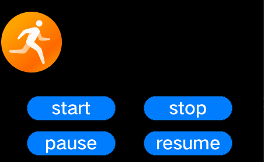

# 动画开发指导<a name="ZH-CN_TOPIC_0000001051451654"></a>

## 使用场景<a name="section726685714018"></a>

UI动画通过task处理机制每个tick调用一下用户设置的callback函数来实现，具体实现为AnimatorManager、Animator、AnimatorCallback三个类实现。

-   AnimatorManager：AnimatorManager为单例，在Init函数执行时将自己注册到系统task回调函数中，系统task机制保证每个tick会调用一下AnimatorManager的callback函数，同时AnimatorManager用来管理Animator实例。
-   Animator：Animator中可以设置动画相关的属性，包括动画的起止时间，动画开始和停止，动画状态的设置和获取等。
-   AnimatorCallback：具体每一个tick动画所要做的内容在AnimatorCallback类中实现，开发者需要自己实现Callback方法，动画执行时在Callback实现相应功能。

## 接口说明<a name="section85794718418"></a>

**表 1**  动画接口说明

<a name="table15207105417246"></a>
<table><thead align="left"><tr id="row1389130182514"><th class="cellrowborder" valign="top" width="17.349999999999998%" id="mcps1.2.4.1.1"><p id="p16390130172517"><a name="p16390130172517"></a><a name="p16390130172517"></a>子模块</p>
</th>
<th class="cellrowborder" valign="top" width="54.13%" id="mcps1.2.4.1.2"><p id="p239060112519"><a name="p239060112519"></a><a name="p239060112519"></a>方法</p>
</th>
<th class="cellrowborder" valign="top" width="28.52%" id="mcps1.2.4.1.3"><p id="p1839012019257"><a name="p1839012019257"></a><a name="p1839012019257"></a>功能</p>
</th>
</tr>
</thead>
<tbody><tr id="row1533075412415"><td class="cellrowborder" valign="top" width="17.349999999999998%" headers="mcps1.2.4.1.1 "><p id="p633015547249"><a name="p633015547249"></a><a name="p633015547249"></a>Animator</p>
</td>
<td class="cellrowborder" valign="top" width="54.13%" headers="mcps1.2.4.1.2 "><p id="p6330554152411"><a name="p6330554152411"></a><a name="p6330554152411"></a>void  Start ()</p>
</td>
<td class="cellrowborder" valign="top" width="28.52%" headers="mcps1.2.4.1.3 "><p id="p3330155472412"><a name="p3330155472412"></a><a name="p3330155472412"></a>动画开始</p>
</td>
</tr>
<tr id="row18330175410241"><td class="cellrowborder" valign="top" width="17.349999999999998%" headers="mcps1.2.4.1.1 "><p id="p33301454172415"><a name="p33301454172415"></a><a name="p33301454172415"></a>Animator</p>
</td>
<td class="cellrowborder" valign="top" width="54.13%" headers="mcps1.2.4.1.2 "><p id="p12330195419248"><a name="p12330195419248"></a><a name="p12330195419248"></a>void  Stop ()</p>
</td>
<td class="cellrowborder" valign="top" width="28.52%" headers="mcps1.2.4.1.3 "><p id="p23301854162416"><a name="p23301854162416"></a><a name="p23301854162416"></a>动画停止</p>
</td>
</tr>
<tr id="row433045420244"><td class="cellrowborder" valign="top" width="17.349999999999998%" headers="mcps1.2.4.1.1 "><p id="p183301054182410"><a name="p183301054182410"></a><a name="p183301054182410"></a>Animator</p>
</td>
<td class="cellrowborder" valign="top" width="54.13%" headers="mcps1.2.4.1.2 "><p id="p43302054172415"><a name="p43302054172415"></a><a name="p43302054172415"></a>void  Pause ()</p>
</td>
<td class="cellrowborder" valign="top" width="28.52%" headers="mcps1.2.4.1.3 "><p id="p15330854182413"><a name="p15330854182413"></a><a name="p15330854182413"></a>动画暂停</p>
</td>
</tr>
<tr id="row1033085492417"><td class="cellrowborder" valign="top" width="17.349999999999998%" headers="mcps1.2.4.1.1 "><p id="p12331135413244"><a name="p12331135413244"></a><a name="p12331135413244"></a>Animator</p>
</td>
<td class="cellrowborder" valign="top" width="54.13%" headers="mcps1.2.4.1.2 "><p id="p5331165472412"><a name="p5331165472412"></a><a name="p5331165472412"></a>void  Resume ()</p>
</td>
<td class="cellrowborder" valign="top" width="28.52%" headers="mcps1.2.4.1.3 "><p id="p63314543246"><a name="p63314543246"></a><a name="p63314543246"></a>动画恢复</p>
</td>
</tr>
<tr id="row1331175413240"><td class="cellrowborder" valign="top" width="17.349999999999998%" headers="mcps1.2.4.1.1 "><p id="p18331454152418"><a name="p18331454152418"></a><a name="p18331454152418"></a>Animator</p>
</td>
<td class="cellrowborder" valign="top" width="54.13%" headers="mcps1.2.4.1.2 "><p id="p15331155472414"><a name="p15331155472414"></a><a name="p15331155472414"></a>uint8_t  GetState () const</p>
</td>
<td class="cellrowborder" valign="top" width="28.52%" headers="mcps1.2.4.1.3 "><p id="p2033125414243"><a name="p2033125414243"></a><a name="p2033125414243"></a>获取动画当前状态</p>
</td>
</tr>
<tr id="row43311554182415"><td class="cellrowborder" valign="top" width="17.349999999999998%" headers="mcps1.2.4.1.1 "><p id="p33311854172420"><a name="p33311854172420"></a><a name="p33311854172420"></a>Animator</p>
</td>
<td class="cellrowborder" valign="top" width="54.13%" headers="mcps1.2.4.1.2 "><p id="p433165462418"><a name="p433165462418"></a><a name="p433165462418"></a>void  SetState (uint8_t state)</p>
</td>
<td class="cellrowborder" valign="top" width="28.52%" headers="mcps1.2.4.1.3 "><p id="p23316546242"><a name="p23316546242"></a><a name="p23316546242"></a>设置动画当前状态</p>
</td>
</tr>
<tr id="row17331254192419"><td class="cellrowborder" valign="top" width="17.349999999999998%" headers="mcps1.2.4.1.1 "><p id="p173319547243"><a name="p173319547243"></a><a name="p173319547243"></a>Animator</p>
</td>
<td class="cellrowborder" valign="top" width="54.13%" headers="mcps1.2.4.1.2 "><p id="p18332125416243"><a name="p18332125416243"></a><a name="p18332125416243"></a>uint32_t  GetTime () const</p>
</td>
<td class="cellrowborder" valign="top" width="28.52%" headers="mcps1.2.4.1.3 "><p id="p1633295412414"><a name="p1633295412414"></a><a name="p1633295412414"></a>获取动画总持续时间</p>
</td>
</tr>
<tr id="row8332195419241"><td class="cellrowborder" valign="top" width="17.349999999999998%" headers="mcps1.2.4.1.1 "><p id="p2033211545243"><a name="p2033211545243"></a><a name="p2033211545243"></a>Animator</p>
</td>
<td class="cellrowborder" valign="top" width="54.13%" headers="mcps1.2.4.1.2 "><p id="p123321054172415"><a name="p123321054172415"></a><a name="p123321054172415"></a>void  SetTime (uint32_t time)</p>
</td>
<td class="cellrowborder" valign="top" width="28.52%" headers="mcps1.2.4.1.3 "><p id="p4332105472411"><a name="p4332105472411"></a><a name="p4332105472411"></a>设置动画总持续时间</p>
</td>
</tr>
<tr id="row13332125412420"><td class="cellrowborder" valign="top" width="17.349999999999998%" headers="mcps1.2.4.1.1 "><p id="p17332165482417"><a name="p17332165482417"></a><a name="p17332165482417"></a>Animator</p>
</td>
<td class="cellrowborder" valign="top" width="54.13%" headers="mcps1.2.4.1.2 "><p id="p3332115417243"><a name="p3332115417243"></a><a name="p3332115417243"></a>uint32_t  GetRunTime () const</p>
</td>
<td class="cellrowborder" valign="top" width="28.52%" headers="mcps1.2.4.1.3 "><p id="p733275442419"><a name="p733275442419"></a><a name="p733275442419"></a>获取动画当前已经持续的时间</p>
</td>
</tr>
<tr id="row2033215419249"><td class="cellrowborder" valign="top" width="17.349999999999998%" headers="mcps1.2.4.1.1 "><p id="p113327549245"><a name="p113327549245"></a><a name="p113327549245"></a>Animator</p>
</td>
<td class="cellrowborder" valign="top" width="54.13%" headers="mcps1.2.4.1.2 "><p id="p43321154172417"><a name="p43321154172417"></a><a name="p43321154172417"></a>void  SetRunTime (uint32_t runTime)</p>
</td>
<td class="cellrowborder" valign="top" width="28.52%" headers="mcps1.2.4.1.3 "><p id="p173331354182416"><a name="p173331354182416"></a><a name="p173331354182416"></a>设置动画当前已经持续的时间</p>
</td>
</tr>
<tr id="row20333115417249"><td class="cellrowborder" valign="top" width="17.349999999999998%" headers="mcps1.2.4.1.1 "><p id="p2333155412240"><a name="p2333155412240"></a><a name="p2333155412240"></a>Animator</p>
</td>
<td class="cellrowborder" valign="top" width="54.13%" headers="mcps1.2.4.1.2 "><p id="p143335549246"><a name="p143335549246"></a><a name="p143335549246"></a>bool  IsRepeat () const</p>
</td>
<td class="cellrowborder" valign="top" width="28.52%" headers="mcps1.2.4.1.3 "><p id="p23336548244"><a name="p23336548244"></a><a name="p23336548244"></a>获取动画是否循环播放</p>
</td>
</tr>
<tr id="row19333754202418"><td class="cellrowborder" valign="top" width="17.349999999999998%" headers="mcps1.2.4.1.1 "><p id="p1833319543247"><a name="p1833319543247"></a><a name="p1833319543247"></a>AnimatorCallback</p>
</td>
<td class="cellrowborder" valign="top" width="54.13%" headers="mcps1.2.4.1.2 "><p id="p6333135402416"><a name="p6333135402416"></a><a name="p6333135402416"></a>virtual void  Callback (UIView *view)=0</p>
</td>
<td class="cellrowborder" valign="top" width="28.52%" headers="mcps1.2.4.1.3 "><p id="p19333854172417"><a name="p19333854172417"></a><a name="p19333854172417"></a>由用户实现，动画回调函数</p>
</td>
</tr>
<tr id="row193331854112415"><td class="cellrowborder" valign="top" width="17.349999999999998%" headers="mcps1.2.4.1.1 "><p id="p1133325482420"><a name="p1133325482420"></a><a name="p1133325482420"></a>AnimatorCallback</p>
</td>
<td class="cellrowborder" valign="top" width="54.13%" headers="mcps1.2.4.1.2 "><p id="p1433585412411"><a name="p1433585412411"></a><a name="p1433585412411"></a>virtual void OnStop(UIView&amp; view) {}</p>
</td>
<td class="cellrowborder" valign="top" width="28.52%" headers="mcps1.2.4.1.3 "><p id="p933595412249"><a name="p933595412249"></a><a name="p933595412249"></a>由用户实现，动画停止后的回调函数</p>
</td>
</tr>
<tr id="row83351654192415"><td class="cellrowborder" valign="top" width="17.349999999999998%" headers="mcps1.2.4.1.1 "><p id="p633525419244"><a name="p633525419244"></a><a name="p633525419244"></a>AnimatorManager</p>
</td>
<td class="cellrowborder" valign="top" width="54.13%" headers="mcps1.2.4.1.2 "><p id="p203351547242"><a name="p203351547242"></a><a name="p203351547242"></a>static AnimatorManager* GetInstance()</p>
</td>
<td class="cellrowborder" valign="top" width="28.52%" headers="mcps1.2.4.1.3 "><p id="p333545412419"><a name="p333545412419"></a><a name="p333545412419"></a>获取AnimatorManager实例</p>
</td>
</tr>
<tr id="row3335954202412"><td class="cellrowborder" valign="top" width="17.349999999999998%" headers="mcps1.2.4.1.1 "><p id="p5335185413247"><a name="p5335185413247"></a><a name="p5335185413247"></a>AnimatorManager</p>
</td>
<td class="cellrowborder" valign="top" width="54.13%" headers="mcps1.2.4.1.2 "><p id="p11336145442417"><a name="p11336145442417"></a><a name="p11336145442417"></a>void  Add (Animator *animator)</p>
</td>
<td class="cellrowborder" valign="top" width="28.52%" headers="mcps1.2.4.1.3 "><p id="p10336175492416"><a name="p10336175492416"></a><a name="p10336175492416"></a>添加动画</p>
</td>
</tr>
<tr id="row18336185422417"><td class="cellrowborder" valign="top" width="17.349999999999998%" headers="mcps1.2.4.1.1 "><p id="p103361554192411"><a name="p103361554192411"></a><a name="p103361554192411"></a>AnimatorManager</p>
</td>
<td class="cellrowborder" valign="top" width="54.13%" headers="mcps1.2.4.1.2 "><p id="p6336195442412"><a name="p6336195442412"></a><a name="p6336195442412"></a>void Remove(const Animator* animator);</p>
</td>
<td class="cellrowborder" valign="top" width="28.52%" headers="mcps1.2.4.1.3 "><p id="p233615442420"><a name="p233615442420"></a><a name="p233615442420"></a>删除动画</p>
</td>
</tr>
</tbody>
</table>

## 开发步骤<a name="section14101161317435"></a>

1.  实现AnimatorCallback的回调函数。

    ```
    class AnimatorCallbackDemo : public OHOS::AnimatorCallback {
    public:
        AnimatorCallbackDemo(int16_t startPos, int16_t endPos, uint16_t time)
            : start_(startPos), end_(endPos), time_(time), curTime_(0) {}
     
        virtual void Callback(OHOS::UIView* view)
        {
            curTime_++;
            int16_t pos = EasingEquation::CubicEaseIn(start_, end_, curTime_, time_);
            view->Invalidate();
            view->SetPosition(pos, view->GetY());
            view->Invalidate();
        }
    protected:
        int16_t start_;
        int16_t end_;
        uint16_t time_;
        uint16_t curTime_;
    };
    ```

2.  将AnimatorCallback添加到Animator中。

    ```
    UIImageView* image = new UIImageView();
    image->SetSrc("..\\config\\images\\A021_001.bin");
    image->SetPosition(0, 50);
    AnimatorCallbackDemo* callback = new AnimatorCallbackDemo(0, 338, 60);
    Animator* animator = new Animator(callback, image, 0, true);
    ```

3.  将Animator添加到AnimatorManager中。

    ```
    AnimatorManager::GetInstance()->Add(animator);
    ```

4.  点击下图下方的按钮，检查对应的动画运行效果。

    **图 1**  动画实现效果图<a name="fig17833181682317"></a>  
    


