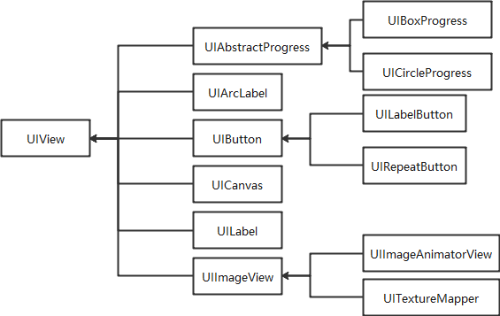
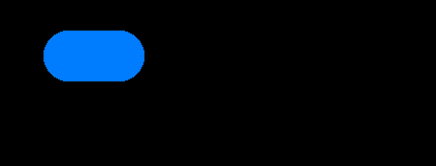

# 普通组件开发指导<a name="ZH-CN_TOPIC_0000001052170409"></a>

普通组件均继承于基类UIView，不可以添加子组件，常用的普通组件有button、image、label等。

**图 1**  普通组件树结构<a name="fig212202732818"></a>  


UIView为基础类，UIAbstractProgress、UIArcLabel（旋转字体）、UIButton（按键）、UICanvas（画布）、UILabel（字体）、UIImageView（图片）从UIView继承。UIBoxProgress、UICircleProgress从UIAbstractProgress继承，UILabelButton和UIRepeatButton从UIButton继承，UIImageAnimatorView和UITextureMapper从UIImageView继承。

## UIButton<a name="section145353310214"></a>

## 使用场景<a name="section1169616141577"></a>

UIButton组件，提供可点击功能，同时可设置不同状态下样式。

## 接口说明<a name="section341211538315"></a>

**表 1**  button接口说明

<a name="table172083013117"></a>
<table><thead align="left"><tr id="row13192303311"><th class="cellrowborder" valign="top" width="50%" id="mcps1.2.3.1.1"><p id="p1019330103113"><a name="p1019330103113"></a><a name="p1019330103113"></a>方法</p>
</th>
<th class="cellrowborder" valign="top" width="50%" id="mcps1.2.3.1.2"><p id="p181963020318"><a name="p181963020318"></a><a name="p181963020318"></a>功能</p>
</th>
</tr>
</thead>
<tbody><tr id="row191914306313"><td class="cellrowborder" valign="top" width="50%" headers="mcps1.2.3.1.1 "><p id="p161963010314"><a name="p161963010314"></a><a name="p161963010314"></a>void SetImageSrc (const char *defaultImgSrc, const char *triggeredImgSrc)</p>
</td>
<td class="cellrowborder" valign="top" width="50%" headers="mcps1.2.3.1.2 "><p id="p1619143014312"><a name="p1619143014312"></a><a name="p1619143014312"></a>设置button图片</p>
</td>
</tr>
<tr id="row141915307313"><td class="cellrowborder" valign="top" width="50%" headers="mcps1.2.3.1.1 "><p id="p419193017312"><a name="p419193017312"></a><a name="p419193017312"></a>void SetImagePosition (const int16_t x, const int16_t y)</p>
</td>
<td class="cellrowborder" valign="top" width="50%" headers="mcps1.2.3.1.2 "><p id="p919030173119"><a name="p919030173119"></a><a name="p919030173119"></a>设置button图片位置</p>
</td>
</tr>
<tr id="row1119930183115"><td class="cellrowborder" valign="top" width="50%" headers="mcps1.2.3.1.1 "><p id="p1619430193110"><a name="p1619430193110"></a><a name="p1619430193110"></a>int16_t GetImageX () const</p>
</td>
<td class="cellrowborder" valign="top" width="50%" headers="mcps1.2.3.1.2 "><p id="p151933012315"><a name="p151933012315"></a><a name="p151933012315"></a>获取图片X坐标</p>
</td>
</tr>
<tr id="row62083017317"><td class="cellrowborder" valign="top" width="50%" headers="mcps1.2.3.1.1 "><p id="p122093053112"><a name="p122093053112"></a><a name="p122093053112"></a>int16_t GetImageY () const</p>
</td>
<td class="cellrowborder" valign="top" width="50%" headers="mcps1.2.3.1.2 "><p id="p62016307314"><a name="p62016307314"></a><a name="p62016307314"></a>获取图片Y坐标</p>
</td>
</tr>
<tr id="row72013013114"><td class="cellrowborder" valign="top" width="50%" headers="mcps1.2.3.1.1 "><p id="p720203016314"><a name="p720203016314"></a><a name="p720203016314"></a>const ImageInfo* GetCurImageSrc() const</p>
</td>
<td class="cellrowborder" valign="top" width="50%" headers="mcps1.2.3.1.2 "><p id="p1201730123116"><a name="p1201730123116"></a><a name="p1201730123116"></a>获取当前状态图片</p>
</td>
</tr>
<tr id="row320103017318"><td class="cellrowborder" valign="top" width="50%" headers="mcps1.2.3.1.1 "><p id="p12010308314"><a name="p12010308314"></a><a name="p12010308314"></a>Style&amp;  GetStyleForState (ButtonState state)</p>
</td>
<td class="cellrowborder" valign="top" width="50%" headers="mcps1.2.3.1.2 "><p id="p17201030133117"><a name="p17201030133117"></a><a name="p17201030133117"></a>设置button当前状态的style</p>
</td>
</tr>
<tr id="row420730193117"><td class="cellrowborder" valign="top" width="50%" headers="mcps1.2.3.1.1 "><p id="p11201830183112"><a name="p11201830183112"></a><a name="p11201830183112"></a>voidSetStyleForState (const Style &amp;style, ButtonState state)</p>
</td>
<td class="cellrowborder" valign="top" width="50%" headers="mcps1.2.3.1.2 "><p id="p82016308311"><a name="p82016308311"></a><a name="p82016308311"></a>设置button指定状态的style</p>
</td>
</tr>
<tr id="row1320193010317"><td class="cellrowborder" valign="top" width="50%" headers="mcps1.2.3.1.1 "><p id="p1020153014319"><a name="p1020153014319"></a><a name="p1020153014319"></a>void Disable ()</p>
</td>
<td class="cellrowborder" valign="top" width="50%" headers="mcps1.2.3.1.2 "><p id="p192063023119"><a name="p192063023119"></a><a name="p192063023119"></a>去使能button</p>
</td>
</tr>
<tr id="row02017308315"><td class="cellrowborder" valign="top" width="50%" headers="mcps1.2.3.1.1 "><p id="p620173011318"><a name="p620173011318"></a><a name="p620173011318"></a>void Enable ()</p>
</td>
<td class="cellrowborder" valign="top" width="50%" headers="mcps1.2.3.1.2 "><p id="p52093073119"><a name="p52093073119"></a><a name="p52093073119"></a>使能button</p>
</td>
</tr>
</tbody>
</table>

## 开发步骤<a name="section22501726193214"></a>

1.  实现点击事件。

    ```
    class TestBtnOnClickListener : public OHOS::UIView::OnClickListener {
        bool OnClick(UIView& view, const ClickEvent& event) override
        {
            int16_t width = view.GetWidth() + 10;
            int16_t height = view.GetHeight() + 10;
            view.Resize(width, height);
            view.Invalidate();
            return true;
        }
    };
    ```

2.  创建一个UIButton。

    ```
    UIButton* button = new UIButton();
    button->SetPosition(50, 50);
    button->SetWidth(100);
    button->SetHeight(50);
    ```

3.  给UIButton注册点击事件回调。

    ```
    button->SetOnClickListener(new TestBtnOnClickListener());
    ```

4.  检查Button点击效果如下图所示，Button逐渐变大。

    **图 2**  UIButton点击效果<a name="fig1921134162020"></a>  
    


## UIImageView<a name="section19523161611259"></a>

## 使用场景<a name="section1274484210400"></a>

图片组件，提供图片显示，透明度设置，图片旋转、缩放功能。支持的图片格式为RGB565、RGB888、RGBA8888、PNG、JPG。

## 接口说明<a name="section74981992411"></a>

**表 2**  image接口说明

<a name="table1584094244019"></a>
<table><thead align="left"><tr id="row483811426401"><th class="cellrowborder" valign="top" width="50%" id="mcps1.2.3.1.1"><p id="p1883814294017"><a name="p1883814294017"></a><a name="p1883814294017"></a>方法</p>
</th>
<th class="cellrowborder" valign="top" width="50%" id="mcps1.2.3.1.2"><p id="p168383425408"><a name="p168383425408"></a><a name="p168383425408"></a>功能</p>
</th>
</tr>
</thead>
<tbody><tr id="row198391442134016"><td class="cellrowborder" valign="top" width="50%" headers="mcps1.2.3.1.1 "><p id="p1383934284013"><a name="p1383934284013"></a><a name="p1383934284013"></a>void SetSrc (const char *src)</p>
</td>
<td class="cellrowborder" valign="top" width="50%" headers="mcps1.2.3.1.2 "><p id="p16839204211400"><a name="p16839204211400"></a><a name="p16839204211400"></a>设置二进制图片路径</p>
</td>
</tr>
<tr id="row9839642194011"><td class="cellrowborder" valign="top" width="50%" headers="mcps1.2.3.1.1 "><p id="p6839194218409"><a name="p6839194218409"></a><a name="p6839194218409"></a>void SetSrc (const ImageInfo *src)</p>
</td>
<td class="cellrowborder" valign="top" width="50%" headers="mcps1.2.3.1.2 "><p id="p1483944218401"><a name="p1483944218401"></a><a name="p1483944218401"></a>设置图片指针</p>
</td>
</tr>
<tr id="row158391342194014"><td class="cellrowborder" valign="top" width="50%" headers="mcps1.2.3.1.1 "><p id="p188395427401"><a name="p188395427401"></a><a name="p188395427401"></a>void SetAutoEnable (bool enable)</p>
</td>
<td class="cellrowborder" valign="top" width="50%" headers="mcps1.2.3.1.2 "><p id="p15839642204010"><a name="p15839642204010"></a><a name="p15839642204010"></a>设置组件大小跟随image大小变化</p>
</td>
</tr>
<tr id="row4839342154012"><td class="cellrowborder" valign="top" width="50%" headers="mcps1.2.3.1.1 "><p id="p11839142154019"><a name="p11839142154019"></a><a name="p11839142154019"></a>const void* GetSrcType () const</p>
</td>
<td class="cellrowborder" valign="top" width="50%" headers="mcps1.2.3.1.2 "><p id="p283913422406"><a name="p283913422406"></a><a name="p283913422406"></a>获取图片类型</p>
</td>
</tr>
<tr id="row283918426406"><td class="cellrowborder" valign="top" width="50%" headers="mcps1.2.3.1.1 "><p id="p14839134217401"><a name="p14839134217401"></a><a name="p14839134217401"></a>bool GetAutoEnable () const</p>
</td>
<td class="cellrowborder" valign="top" width="50%" headers="mcps1.2.3.1.2 "><p id="p58391242154014"><a name="p58391242154014"></a><a name="p58391242154014"></a>获取组件大小是否跟随image大小变化</p>
</td>
</tr>
<tr id="row183912426406"><td class="cellrowborder" valign="top" width="50%" headers="mcps1.2.3.1.1 "><p id="p78391242134016"><a name="p78391242134016"></a><a name="p78391242134016"></a>void SetBlurLevel(BlurLevel level)</p>
</td>
<td class="cellrowborder" valign="top" width="50%" headers="mcps1.2.3.1.2 "><p id="p38391342174018"><a name="p38391342174018"></a><a name="p38391342174018"></a>设置模糊等级</p>
</td>
</tr>
<tr id="row9840842174012"><td class="cellrowborder" valign="top" width="50%" headers="mcps1.2.3.1.1 "><p id="p3839442184018"><a name="p3839442184018"></a><a name="p3839442184018"></a>BlurLevel GetBlurLevel() const</p>
</td>
<td class="cellrowborder" valign="top" width="50%" headers="mcps1.2.3.1.2 "><p id="p4840342134016"><a name="p4840342134016"></a><a name="p4840342134016"></a>获取模糊等级</p>
</td>
</tr>
<tr id="row184015424405"><td class="cellrowborder" valign="top" width="50%" headers="mcps1.2.3.1.1 "><p id="p13840144214405"><a name="p13840144214405"></a><a name="p13840144214405"></a>void SetTransformAlgorithm(TransformAlgorithm algorithm)</p>
</td>
<td class="cellrowborder" valign="top" width="50%" headers="mcps1.2.3.1.2 "><p id="p1284034224016"><a name="p1284034224016"></a><a name="p1284034224016"></a>设置旋转算法</p>
</td>
</tr>
<tr id="row1484064244017"><td class="cellrowborder" valign="top" width="50%" headers="mcps1.2.3.1.1 "><p id="p11840204211402"><a name="p11840204211402"></a><a name="p11840204211402"></a>TransformAlgorithm GetTransformAlgorithm() const</p>
</td>
<td class="cellrowborder" valign="top" width="50%" headers="mcps1.2.3.1.2 "><p id="p5840124219407"><a name="p5840124219407"></a><a name="p5840124219407"></a>获取旋转算法</p>
</td>
</tr>
</tbody>
</table>

## 开发步骤（自适应）<a name="section144341333134114"></a>

1.  创建一个UIImageView。

    ```
    UIImageView* imageView = new UIImageView();
    imageView->SetPosition(0, 30);
    ```

2.  设置二进制格式的图片。

    ```
    imageView->SetSrc("..\\config\\images\\A021_001.bin");
    ```

3.  检查UIImageView控件大小与图片相同。

    **图 3**  自适应模式图片效果图<a name="fig64751933144118"></a>  
    


## 开发步骤（平铺模式）<a name="section97178160421"></a>

1.  创建一个UIImageView。

    ```
    UIImageView* imageView = new UIImageView();
    imageView->SetPosition(0, 30);
    ```

2.  设置图片。

    ```
    imageView->SetSrc("..\\config\\images\\A021_001.bin");
    ```

3.  取消图片自适应，设置图片大小，平铺显示效果。

    ```
    imageView->SetAutoEnable(false);
    imageView->Resize(454, 150);
    ```

4.  检查UIImageView控件显示为平铺效果。

    **图 4**  平铺模式图片效果图<a name="fig1075461619424"></a>  
    


## UILabel<a name="section16588132012911"></a>

## 使用场景<a name="section6870195634218"></a>

标签（label）是在一块区域上显示文本字符串的组件，可设置区域背景色、文字的显示样式和长文本的显示效果等。

## 接口说明<a name="section2012714510433"></a>

**表 3**  label接口说明

<a name="table10748131564314"></a>
<table><thead align="left"><tr id="row874571512438"><th class="cellrowborder" valign="top" width="46.37%" id="mcps1.2.3.1.1"><p id="p137446152439"><a name="p137446152439"></a><a name="p137446152439"></a>方法</p>
</th>
<th class="cellrowborder" valign="top" width="53.63%" id="mcps1.2.3.1.2"><p id="p2744161518431"><a name="p2744161518431"></a><a name="p2744161518431"></a>功能</p>
</th>
</tr>
</thead>
<tbody><tr id="row674561515438"><td class="cellrowborder" valign="top" width="46.37%" headers="mcps1.2.3.1.1 "><p id="p8745415164311"><a name="p8745415164311"></a><a name="p8745415164311"></a>void SetText(const char* text);</p>
</td>
<td class="cellrowborder" valign="top" width="53.63%" headers="mcps1.2.3.1.2 "><p id="p1474516159433"><a name="p1474516159433"></a><a name="p1474516159433"></a>设置文字</p>
</td>
</tr>
<tr id="row77451315154311"><td class="cellrowborder" valign="top" width="46.37%" headers="mcps1.2.3.1.1 "><p id="p18745111513437"><a name="p18745111513437"></a><a name="p18745111513437"></a>const char* GetText() const;</p>
</td>
<td class="cellrowborder" valign="top" width="53.63%" headers="mcps1.2.3.1.2 "><p id="p117451015194320"><a name="p117451015194320"></a><a name="p117451015194320"></a>获取text</p>
</td>
</tr>
<tr id="row6745121516437"><td class="cellrowborder" valign="top" width="46.37%" headers="mcps1.2.3.1.1 "><p id="p167451615104316"><a name="p167451615104316"></a><a name="p167451615104316"></a>void SetLineBreakMode(const uint8_t lineBreakMode);</p>
</td>
<td class="cellrowborder" valign="top" width="53.63%" headers="mcps1.2.3.1.2 "><p id="p674511564316"><a name="p674511564316"></a><a name="p674511564316"></a>设置label模式，例如截断，自动扩展等。</p>
</td>
</tr>
<tr id="row2745115104318"><td class="cellrowborder" valign="top" width="46.37%" headers="mcps1.2.3.1.1 "><p id="p274518155436"><a name="p274518155436"></a><a name="p274518155436"></a>uint8_t GetLineBreakMode() const</p>
</td>
<td class="cellrowborder" valign="top" width="53.63%" headers="mcps1.2.3.1.2 "><p id="p3745161584312"><a name="p3745161584312"></a><a name="p3745161584312"></a>获取label模式</p>
</td>
</tr>
<tr id="row17745515114319"><td class="cellrowborder" valign="top" width="46.37%" headers="mcps1.2.3.1.1 "><p id="p1745101544317"><a name="p1745101544317"></a><a name="p1745101544317"></a>void SetTextColor(ColorType color)</p>
</td>
<td class="cellrowborder" valign="top" width="53.63%" headers="mcps1.2.3.1.2 "><p id="p1174541518431"><a name="p1174541518431"></a><a name="p1174541518431"></a>设置文本颜色</p>
</td>
</tr>
<tr id="row1074541511437"><td class="cellrowborder" valign="top" width="46.37%" headers="mcps1.2.3.1.1 "><p id="p4745121514434"><a name="p4745121514434"></a><a name="p4745121514434"></a>ColorType GetTextColor() const</p>
</td>
<td class="cellrowborder" valign="top" width="53.63%" headers="mcps1.2.3.1.2 "><p id="p1674510152436"><a name="p1674510152436"></a><a name="p1674510152436"></a>获取文本颜色</p>
</td>
</tr>
<tr id="row874651510439"><td class="cellrowborder" valign="top" width="46.37%" headers="mcps1.2.3.1.1 "><p id="p1674561513439"><a name="p1674561513439"></a><a name="p1674561513439"></a>void SetAlign(UITextLanguageAlignment horizontalAlign,</p>
<p id="p1374661594317"><a name="p1374661594317"></a><a name="p1374661594317"></a>UITextLanguageAlignment verticalAlign = TEXT_ALIGNMENT_TOP);</p>
</td>
<td class="cellrowborder" valign="top" width="53.63%" headers="mcps1.2.3.1.2 "><p id="p874621517438"><a name="p874621517438"></a><a name="p874621517438"></a>设置文本对齐方式</p>
</td>
</tr>
<tr id="row15746151514437"><td class="cellrowborder" valign="top" width="46.37%" headers="mcps1.2.3.1.1 "><p id="p174615155439"><a name="p174615155439"></a><a name="p174615155439"></a>UITextLanguageAlignment GetHorAlign() const</p>
</td>
<td class="cellrowborder" valign="top" width="53.63%" headers="mcps1.2.3.1.2 "><p id="p1774614151434"><a name="p1774614151434"></a><a name="p1774614151434"></a>获取文本水平对齐方式</p>
</td>
</tr>
<tr id="row197467150431"><td class="cellrowborder" valign="top" width="46.37%" headers="mcps1.2.3.1.1 "><p id="p127469152437"><a name="p127469152437"></a><a name="p127469152437"></a>UITextLanguageAlignment GetVerAlign() const</p>
</td>
<td class="cellrowborder" valign="top" width="53.63%" headers="mcps1.2.3.1.2 "><p id="p1974651554314"><a name="p1974651554314"></a><a name="p1974651554314"></a>获取文本竖直对齐方式</p>
</td>
</tr>
<tr id="row1474613152438"><td class="cellrowborder" valign="top" width="46.37%" headers="mcps1.2.3.1.1 "><p id="p147468156433"><a name="p147468156433"></a><a name="p147468156433"></a>void SetDirect(UITextLanguageDirect direct)</p>
</td>
<td class="cellrowborder" valign="top" width="53.63%" headers="mcps1.2.3.1.2 "><p id="p474611554312"><a name="p474611554312"></a><a name="p474611554312"></a>设置文本显示方向</p>
</td>
</tr>
<tr id="row1374661524316"><td class="cellrowborder" valign="top" width="46.37%" headers="mcps1.2.3.1.1 "><p id="p6746131514310"><a name="p6746131514310"></a><a name="p6746131514310"></a>UITextLanguageDirect GetDirect() const</p>
</td>
<td class="cellrowborder" valign="top" width="53.63%" headers="mcps1.2.3.1.2 "><p id="p1274681514319"><a name="p1274681514319"></a><a name="p1274681514319"></a>获取文本显示方向</p>
</td>
</tr>
<tr id="row3746115164316"><td class="cellrowborder" valign="top" width="46.37%" headers="mcps1.2.3.1.1 "><p id="p17746415134312"><a name="p17746415134312"></a><a name="p17746415134312"></a>void SetFontId(uint8_t fontId);</p>
</td>
<td class="cellrowborder" valign="top" width="53.63%" headers="mcps1.2.3.1.2 "><p id="p174615150437"><a name="p174615150437"></a><a name="p174615150437"></a>设置动态字体id</p>
</td>
</tr>
<tr id="row57471415134313"><td class="cellrowborder" valign="top" width="46.37%" headers="mcps1.2.3.1.1 "><p id="p13746131511435"><a name="p13746131511435"></a><a name="p13746131511435"></a>uint8_t GetFontId() const</p>
</td>
<td class="cellrowborder" valign="top" width="53.63%" headers="mcps1.2.3.1.2 "><p id="p17746515204313"><a name="p17746515204313"></a><a name="p17746515204313"></a>获取动态字体id</p>
</td>
</tr>
<tr id="row13747115124310"><td class="cellrowborder" valign="top" width="46.37%" headers="mcps1.2.3.1.1 "><p id="p147471815124314"><a name="p147471815124314"></a><a name="p147471815124314"></a>void SetFont(const char *name, uint8_t size);</p>
</td>
<td class="cellrowborder" valign="top" width="53.63%" headers="mcps1.2.3.1.2 "><p id="p674714158439"><a name="p674714158439"></a><a name="p674714158439"></a>设置字的名字和大小</p>
</td>
</tr>
<tr id="row177471015184318"><td class="cellrowborder" valign="top" width="46.37%" headers="mcps1.2.3.1.1 "><p id="p16747715104310"><a name="p16747715104310"></a><a name="p16747715104310"></a>void SetAnimatorSpeed(uint16_t animSpeed);</p>
</td>
<td class="cellrowborder" valign="top" width="53.63%" headers="mcps1.2.3.1.2 "><p id="p2747615204319"><a name="p2747615204319"></a><a name="p2747615204319"></a>设置字体旋转的速度</p>
</td>
</tr>
<tr id="row474701534317"><td class="cellrowborder" valign="top" width="46.37%" headers="mcps1.2.3.1.1 "><p id="p374719152439"><a name="p374719152439"></a><a name="p374719152439"></a>uint16_t GetTextWidth();</p>
</td>
<td class="cellrowborder" valign="top" width="53.63%" headers="mcps1.2.3.1.2 "><p id="p13747111574315"><a name="p13747111574315"></a><a name="p13747111574315"></a>获取字体的宽</p>
</td>
</tr>
<tr id="row117471015164313"><td class="cellrowborder" valign="top" width="46.37%" headers="mcps1.2.3.1.1 "><p id="p774771511438"><a name="p774771511438"></a><a name="p774771511438"></a>uint16_t GetTextHeight();</p>
</td>
<td class="cellrowborder" valign="top" width="53.63%" headers="mcps1.2.3.1.2 "><p id="p6747121518432"><a name="p6747121518432"></a><a name="p6747121518432"></a>获取字体的高</p>
</td>
</tr>
<tr id="row7747201504317"><td class="cellrowborder" valign="top" width="46.37%" headers="mcps1.2.3.1.1 "><p id="p474731584311"><a name="p474731584311"></a><a name="p474731584311"></a>void SetRollStartPos(int16_t pos)</p>
</td>
<td class="cellrowborder" valign="top" width="53.63%" headers="mcps1.2.3.1.2 "><p id="p1674713155432"><a name="p1674713155432"></a><a name="p1674713155432"></a>设置旋转的位置</p>
</td>
</tr>
<tr id="row16747215174313"><td class="cellrowborder" valign="top" width="46.37%" headers="mcps1.2.3.1.1 "><p id="p9747815134313"><a name="p9747815134313"></a><a name="p9747815134313"></a>int16_t GetRollStartPos() const</p>
</td>
<td class="cellrowborder" valign="top" width="53.63%" headers="mcps1.2.3.1.2 "><p id="p7747191574315"><a name="p7747191574315"></a><a name="p7747191574315"></a>获取旋转的位置</p>
</td>
</tr>
<tr id="row117489151434"><td class="cellrowborder" valign="top" width="46.37%" headers="mcps1.2.3.1.1 "><p id="p11747915164316"><a name="p11747915164316"></a><a name="p11747915164316"></a>void SetTextRotation(LabelRotateDegree angle)</p>
</td>
<td class="cellrowborder" valign="top" width="53.63%" headers="mcps1.2.3.1.2 "><p id="p127486152434"><a name="p127486152434"></a><a name="p127486152434"></a>设置文本旋转角度枚举值</p>
</td>
</tr>
<tr id="row1474831544318"><td class="cellrowborder" valign="top" width="46.37%" headers="mcps1.2.3.1.1 "><p id="p117481215194318"><a name="p117481215194318"></a><a name="p117481215194318"></a>LabelRotateDegree GetTextRotation() const</p>
</td>
<td class="cellrowborder" valign="top" width="53.63%" headers="mcps1.2.3.1.2 "><p id="p18748151544319"><a name="p18748151544319"></a><a name="p18748151544319"></a>获取文本旋转角度枚举值</p>
</td>
</tr>
<tr id="row4748615154315"><td class="cellrowborder" valign="top" width="46.37%" headers="mcps1.2.3.1.1 "><p id="p20748141515431"><a name="p20748141515431"></a><a name="p20748141515431"></a>uint16_t GetTextRotateDegree() const</p>
</td>
<td class="cellrowborder" valign="top" width="53.63%" headers="mcps1.2.3.1.2 "><p id="p37481315144310"><a name="p37481315144310"></a><a name="p37481315144310"></a>获取文本旋转角度数值</p>
</td>
</tr>
</tbody>
</table>

## 开发步骤（默认模式）<a name="section83221538114410"></a>

1.  创建label，设置大小和位置信息。

    ```
    UILabel* label = new UILabel();
    label->SetPosition(x, y);
    label->Resize(width, height);
    ```

2.  设置字形信息。

    ```
    label->SetFont("SourceHanSansSC-Regular.otf", 30);
    ```

3.  设置文本数据。

    ```
    label->SetText("label");
    ```

4.  检查label大小和显示效果正常，如下图所示。

    


## 开发步骤（背景色和透明度）<a name="section933360204510"></a>

1.  创建label，设置大小和位置信息。

    ```
    UILabel* label = new UILabel();
    label->SetPosition(x, y);
    label->Resize(width, height);
    ```

2.  设置字形信息。

    ```
    label->SetFont("SourceHanSansSC-Regular.otf", 30);
    ```

3.  设置背景颜色及透明度效果。

    ```
    label->SetStyle(STYLE_BACKGROUND_COLOR, Color::Gray().full);
    label->SetStyle(STYLE_BACKGROUND_OPA, 127);
    label->SetText("Label");
    ```

4.  检查label背景色为Gray，如下图所示。

    


## 开发步骤（字符间距）<a name="section19447826124518"></a>

1.  创建label，设置大小和位置信息。

    ```
    UILabel* label = new UILabel();
    label->SetPosition(x, y);
    label->Resize(width, height);
    ```

2.  设置字形信息。

    ```
    label->SetFont("SourceHanSansSC-Regular.otf", 30);
    ```

3.  设置字体颜色和字间距效果。

    ```
    label->SetStyle(STYLE_BACKGROUND_COLOR, Color::Gray().full);
    label->SetStyle(STYLE_LETTER_SPACE, 5);
    label->SetText("Label");
    ```

4.  检查label字符间距为5，如下图所示。

    


## 开发步骤（大小自适应）<a name="section101711842154617"></a>

当文本过长时，可根据文本信息自动调整label组件大小，也可以设置文本截断或者文本滚动效果。

1.  创建label，设置大小和位置信息。

    ```
    UILabel* label = new UILabel();
    label->SetPosition(x, y);
    label->Resize(width, height);
    ```

2.  设置字形信息。

    ```
    label->SetFont("SourceHanSansSC-Regular.otf", 30);
    ```

3.  设置字体颜色为Gray，组件大小自适应文本内容。

    ```
    label->SetStyle(STYLE_BACKGROUND_COLOR, Color::Gray().full);
    label->SetLineBreakMode(UILabel::LINE_BREAK_ADAPT);
    label->SetText("123\n567890");
    ```

4.  检查label大小自适应文本内容，如下图所示。

    


## 开发步骤（省略号模式）<a name="section1249519410471"></a>

省略号模式指文本内容显示不下时，在末尾显示省略号。

1.  创建label，设置大小和位置信息。

    ```
    UILabel* label = new UILabel();
    label->SetPosition(x, y);
    label->Resize(width, height);
    ```

2.  设置字形信息。

    ```
    label->SetFont("SourceHanSansSC-Regular.otf", 30);
    ```

3.  设置换行模式为DOT模式

    ```
    label->SetStyle(STYLE_BACKGROUND_COLOR, Color::Gray().full);
    label->SetLineBreakMode(UILabel::LINE_BREAK_ELLIPSIS);
    label->SetText("123567890");
    ```

4.  检查label DOT模式效果，如下图所示，末尾显示省略号。

    


## 开发步骤（滚动模式）<a name="section15643122618478"></a>

文本滚动显示。

1.  创建label，设置大小和位置信息。

    ```
    UILabel* label = new UILabel();
    label->SetPosition(x, y);
    label->Resize(width, height);
    ```

2.  设置字形信息。

    ```
    label->SetFont("SourceHanSansSC-Regular.otf", 30);
    ```

3.  设置换行模式为滚动模式

    ```
    label->SetStyle(STYLE_BACKGROUND_COLOR, Color::Gray().full);
    label->SetStyle(STYLE_BACKGROUND_OPA, 127);
    label->SetLineBreakMode(UILabel::LINE_BREAK_MARQUEE);
    label->SetText("123567890");
    ```

4.  检查label滚动模式效果，如下图所示。

    .gif)


